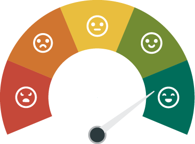
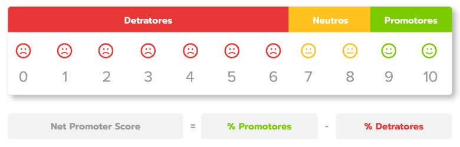

<h1 align="center">
  API: Cálculo de NPS
</h1>
<h1 align="center">
    
</h1>

  <h1>
    🛠 Tecnologias Usadas
  </h1>

  
  
  
  

  <h1>📝 O que é NPS?</h1>
  O NPS® ou Net Promoter Score é uma métrica desenvolvida para medir os níveis de lealdade do cliente, criada em 2003 pelo consultor da Bain & Company, Fred Reichheld, em colaboração com a Satmetrix.
     

<h1 align="center">
    
</h1>

 

  Projeto desenvolvido durante a **[Next Level Week](https://nextlevelweek.com/)**, realizada pela **[@Rocketseat](https://github.com/Rocketseat)** durante os dias 22 a 28 de Fevereiro de 2021.

 

  | [ @pedrorivald](https://github.com/pedrorivald) |
| :---: |

